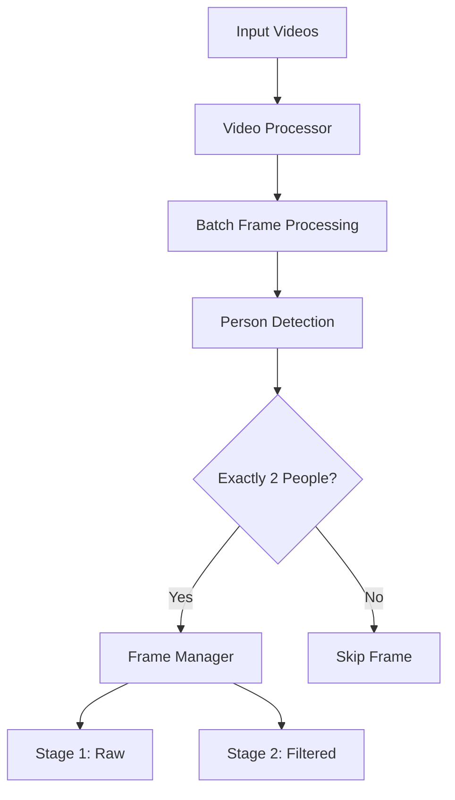
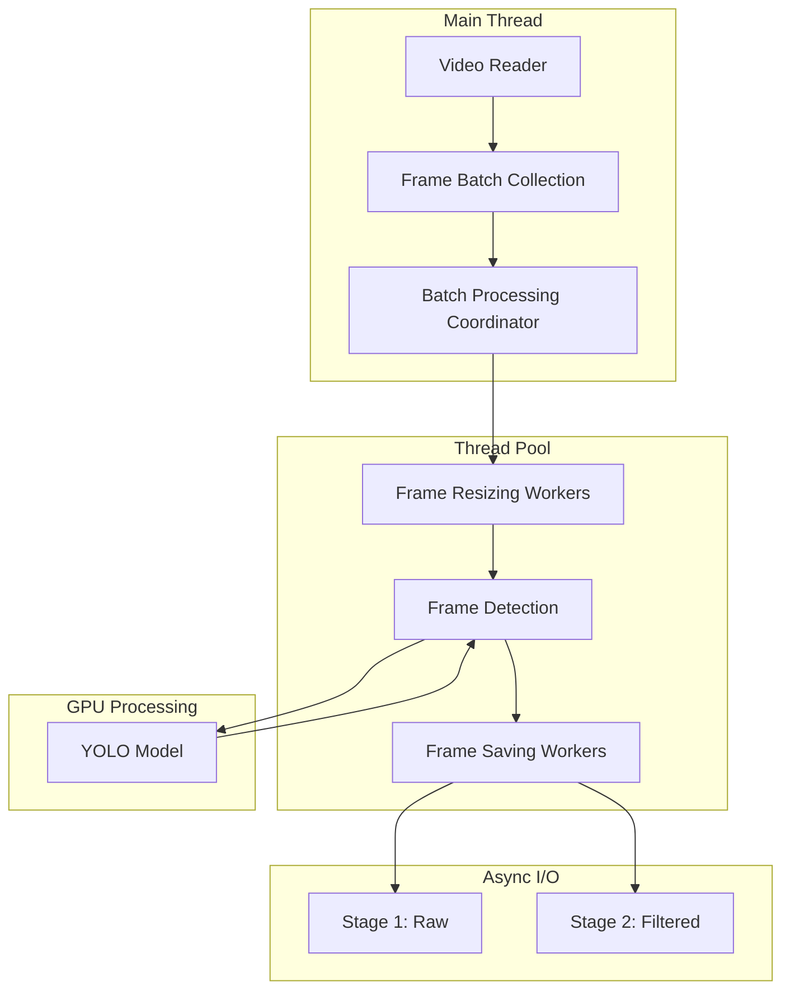

# Video Logs Extract

A Python CLI tool for analyzing home camera recordings and extracting frames containing exactly two people.

## Overview

This tool processes video files from security cameras to automatically detect and extract frames where exactly two people are present. It uses YOLOv8 for person detection and OpenCV for video processing, with optimized batch processing and GPU acceleration.



## Features

- Multi-threaded batch video processing
- GPU-accelerated person detection using YOLOv8
- Staged output with raw and filtered frames
- Real-time progress tracking with ETA
- Configurable detection parameters
- Efficient frame skipping and batch processing
- Support for common video formats
- Detailed metadata for each extracted frame

## Project Structure

```
video-logs-extract/
├── src/
│   ├── __init__.py
│   ├── video_processor.py     # Video batch processing and coordination
│   ├── person_detector.py     # YOLOv8 detection with GPU optimization
│   ├── frame_buffer.py        # Async frame buffer management
│   └── utils.py              # Progress tracking and frame management
├── tests/
│   ├── __init__.py
│   ├── test_video_processor.py
│   ├── test_person_detector.py
│   └── test_frame_buffer.py
├── config/
│   └── default_config.yaml    # Configuration parameters
├── output/
│   ├── stage1_raw/           # Initial frame extractions
│   └── stage2_filtered/      # Post-processed frames
├── main.py                   # CLI entry point
├── extract-video.fish        # Fish shell wrapper
├── requirements.txt
└── README.md
```

## Requirements

- Python 3.8+
- OpenCV
- YOLOv8
- PyTorch (with CUDA support recommended)
- NumPy

```bash
pip install -r requirements.txt
```

## Usage

1. Copy and configure environment settings:
```bash
cp .env.example .env
# Edit .env with your input/output directories
```

2. Run using the fish shell script:
```bash
./extract-video.fish
```

Or run directly with Python:
```bash
python main.py
```

## Configuration

### Environment Variables (.env)
```bash
# Required settings
INPUT_DIR=/path/to/videos
OUTPUT_DIR=/path/to/output

# Optional settings
CONFIDENCE=0.6        # Detection confidence threshold
SKIP_FRAMES=5        # Process every Nth frame
OUTPUT_FORMAT=jpg    # Output image format
PERSON_COUNT=2      # Number of people to detect
```

### Configuration File (config/default_config.yaml)
```yaml
detection:
  model: "yolov8n.pt"         # Model to use
  confidence_threshold: 0.8    # Default confidence (can be overridden by .env)
  person_count: 2             # Number of people to detect
  skip_frames: 5              # Frame skip rate
  resize_width: 640          # Input frame width
  resize_height: 640         # Input frame height

output:
  format: "{timestamp}.jpg"   # Output filename format
  quality: 95                # JPEG quality
  min_interval_seconds: 5    # Minimum time between saved frames

processing:
  batch_size: 32            # Frames to process at once
  use_gpu: true            # Enable GPU acceleration
  half_precision: true     # Use FP16 for faster processing
  num_threads: 8           # Worker thread count
  buffer_size: 128         # Frame buffer size
  log_level: "INFO"        # Logging verbosity
```

## Output Structure

The tool organizes extracted frames in a two-stage structure:

1. `stage1_raw/`: Initial frame extractions with metadata
   - Frame images: `YYYYMMDD_HHMMSS.jpg`
   - Metadata: `YYYYMMDD_HHMMSS.json`

2. `stage2_filtered/`: Post-processed frames (for future processing)

Each frame's metadata includes:
- Timestamp
- Detection confidence scores
- Bounding box coordinates
- Processing information

## Performance Features

- GPU acceleration with half-precision (FP16)
- Multi-threaded frame processing
- Batch frame detection
- Efficient frame skipping
- Asynchronous I/O operations
- Progress tracking with ETA
- Adaptive frame rate processing

## Multi-Threading Architecture

The application implements a sophisticated multi-threading architecture to maximize performance across CPU and GPU resources. Here's a detailed breakdown:

### Thread Pools and Processing Layers



### Key Components

1. **Thread Pool Executors**
   - `ThreadPoolExecutor`: Handles I/O-bound tasks (frame saving)
   - `ProcessPoolExecutor`: Manages CPU-bound tasks (frame resizing)
   ```python
   max_workers = config['processing'].get('max_workers', mp.cpu_count())
   self.thread_pool = ThreadPoolExecutor(max_workers=max_workers)
   self.process_pool = ProcessPoolExecutor(max_workers=max_workers)
   ```

2. **Frame Processing Pipeline**
   ```mermaid
   sequenceDiagram
       participant MT as Main Thread
       participant RP as Resize Pool
       participant GPU as GPU Detection
       participant TP as Thread Pool
       participant IO as Disk I/O

       MT->>MT: Collect Frame Batch
       MT->>RP: Resize Frames
       activate RP
       RP-->>MT: Resized Frames
       deactivate RP
       MT->>GPU: Detect Persons
       activate GPU
       GPU-->>MT: Detection Results
       deactivate GPU
       MT->>TP: Save Frames
       activate TP
       TP->>IO: Write Files
       IO-->>TP: Files Saved
       TP-->>MT: Save Complete
       deactivate TP
   ```

3. **Asynchronous Frame Buffer**
   - Manages frame queues between threads
   - Implements producer-consumer pattern
   ```python
   class FrameBuffer:
       def __init__(self, buffer_size: int = 100):
           self.frame_queue = Queue(maxsize=buffer_size)
           self.result_queue = Queue(maxsize=buffer_size)
   ```

4. **GPU Optimization**
   - Utilizes CUDA for YOLO model inference
   - Supports half-precision (FP16) for faster processing
   ```python
   if torch.cuda.is_available() and config['processing'].get('use_gpu', True):
       self.model.to('cuda')
       if self.use_half:
           self.model.model.half()
   ```

### Processing Flow

1. **Frame Collection**
   - Main thread reads video frames
   - Frames are collected into batches
   - Batch size is configurable (default: 32)

2. **Parallel Frame Preparation**
   - Process pool resizes frames concurrently
   - Maintains aspect ratio while targeting model input size
   ```python
   def prepare_frame_batch(self, frames: List[np.ndarray]) -> List[np.ndarray]:
       target_size = (
           self.config['detection'].get('resize_width', 640),
           self.config['detection'].get('resize_height', 640)
       )
   ```

3. **GPU Detection**
   - Batched frames sent to GPU
   - YOLO model processes entire batch
   - Results filtered for confidence and person count

4. **Asynchronous Saving**
   - Thread pool handles file I/O
   - Metadata generation and saving
   - Progress updates

### Performance Considerations

1. **Resource Utilization**
   - CPU threads for I/O and preprocessing
   - GPU for neural network inference
   - Disk I/O handled asynchronously

2. **Memory Management**
   - Frame buffer prevents memory overflow
   - Batch processing reduces GPU memory transfers
   - Automatic CUDA memory cleanup

3. **Bottleneck Prevention**
   - Frame skipping for high FPS videos
   - Configurable batch sizes
   - Adjustable worker counts

### Configuration Options

```yaml
processing:
  batch_size: 32            # Frames to process at once
  use_gpu: true            # Enable GPU acceleration
  half_precision: true     # Use FP16 for faster processing
  num_threads: 8           # Worker thread count
  buffer_size: 128         # Frame buffer size
```

## Contributing

1. Fork the repository
2. Create your feature branch
3. Commit your changes
4. Push to the branch
5. Create a Pull Request

## License

MIT License