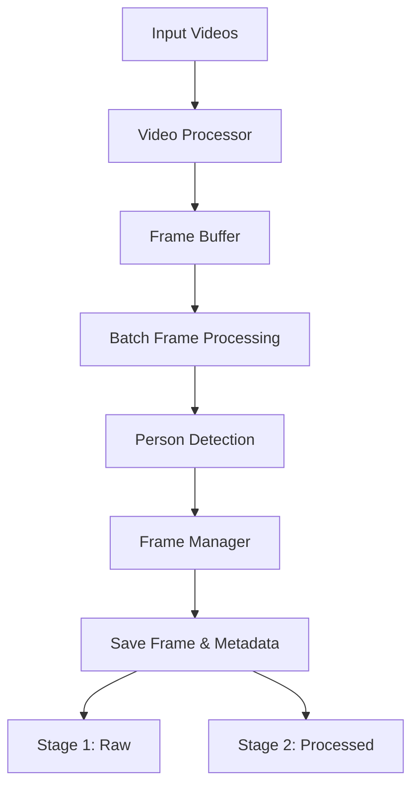

# Video Logs Extract

A Python CLI tool for analyzing home camera recordings and extracting frames containing people.

## Overview

This tool processes video files from security cameras to automatically detect and extract frames where people are present. It uses YOLOv8 for person detection and OpenCV for video processing, with optimized batch processing and GPU acceleration.



## Features

- Multi-threaded batch video processing
- GPU-accelerated person detection using YOLOv8
- Asynchronous frame reading and processing
- Real-time progress tracking with ETA
- Configurable detection parameters
- Efficient frame skipping and batch processing
- Support for common video formats
- Detailed metadata for each extracted frame
- Performance metrics tracking

## Project Structure

```
video-logs-extract/
├── src/
│   ├── __init__.py
│   ├── video_processor.py     # Video batch processing and coordination
│   ├── person_detector.py     # YOLOv8 detection with GPU optimization
│   ├── frame_buffer.py        # Async frame buffer management
│   └── utils.py              # Progress tracking and frame management
├── config/
│   └── default_config.yaml    # Configuration parameters
├── output/
│   ├── stage1_raw/           # Initial frame extractions
│   └── stage2_processed/     # Post-processed frames
├── main.py                   # CLI entry point
└── README.md
```

## Requirements

- Python 3.8+
- OpenCV
- YOLOv8
- PyTorch (with CUDA/MPS support recommended)
- NumPy

```bash
pip install -r requirements.txt
```

## Usage

1. Copy and configure environment settings:
```bash
cp .env.example .env
# Edit .env with your input/output directories
```

2. Run with Python:
```bash
python main.py
```

## Configuration

### Environment Variables (.env)
```bash
# Required settings
INPUT_DIR=/path/to/videos
OUTPUT_DIR=/path/to/output

# Optional settings
CONFIDENCE=0.6        # Detection confidence threshold
SKIP_FRAMES=5        # Process every Nth frame
FORMAT=jpg           # Output image format
```

### Configuration File (config/default_config.yaml)
```yaml
detection:
  model: "yolov8n.pt"  # nano model for fastest processing
  confidence_threshold: 0.8
  person_count: 2
  skip_frames: 10  # increased skip rate for faster processing
  adaptive_skip: true
  resize_width: 416  # reduced size for faster processing
  resize_height: 416
  maintain_aspect_ratio: true
  iou_threshold: 0.5
  max_detections: 20  # reduced from default 100
  confidence: 0.5
  target_person_count: 1
  device: cpu

output:
  format: "{timestamp}.jpg"
  quality: 90  # slightly reduced quality for faster saving
  min_interval_seconds: 5
  include_metadata: true
  metadata_format: "{timestamp}.json"
  stage1_raw: output/stage1_raw
  stage2_processed: output/stage2_processed

processing:
  batch_size: 32
  use_gpu: true
  half_precision: false  # MPS doesn't support half precision yet
  cuda_memory_fraction: 0.8
  num_threads: 8
  buffer_size: 64
  use_mps: true  # Use Metal Performance Shaders
  metal_memory_budget: 4096  # 4GB Metal memory budget
  log_level: "INFO"
  frame_skip: 5
  frame_queue_size: 256
  result_queue_size: 64
  prefetch_batches: 2
```

## Output Structure

The tool organizes extracted frames in a two-stage structure:

1. `stage1_raw/`: Initial frame extractions with metadata
   - Frame images: `frame_YYYYMMDD_HHMMSS_uuuuuu.jpg`
   - Metadata: `frame_YYYYMMDD_HHMMSS_uuuuuu.json`

2. `stage2_processed/`: Post-processed frames with detection data

Each frame's metadata includes:
- Timestamp (ISO format)
- Person detections:
  - Bounding boxes
  - Confidence scores
  - Class labels

## Multi-Threading Architecture

The application implements a sophisticated multi-threading architecture to maximize performance:

### Key Components

1. **Frame Buffer**
   - Asynchronous frame reading thread
   - Prefetch thread for frame preparation
   - Configurable queue sizes for optimal memory usage
   ```python
   frame_queue_size: 256    # Frame reading queue
   result_queue_size: 64    # Processing results queue
   prefetch_batches: 2      # Number of batches to prefetch
   ```

2. **Processing Pipeline**
   ```mermaid
   sequenceDiagram
       participant RT as Read Thread
       participant PF as Prefetch Thread
       participant MT as Main Thread
       participant TP as Thread Pool
       participant IO as Disk I/O

       RT->>RT: Read Video Frames
       RT->>PF: Frame Batch
       PF->>MT: Prepared Batch
       MT->>MT: Detect Persons
       MT->>TP: Save Frame
       TP->>IO: Write Files
   ```

3. **Performance Tracking**
   - Read time
   - Resize time
   - Detection time
   - Save time
   - Batch processing statistics

### Performance Features

1. **Resource Optimization**
   - Multi-threaded frame reading and processing
   - Asynchronous I/O for frame saving
   - Configurable batch sizes and queue depths
   - Frame skipping for efficient processing

2. **Memory Management**
   - Frame buffer with controlled queue sizes
   - Batch processing to optimize GPU memory usage
   - Automatic cleanup of completed tasks

3. **Progress Tracking**
   - Real-time progress per video
   - Batch progress across multiple videos
   - ETA calculation
   - FPS monitoring

## License

MIT License